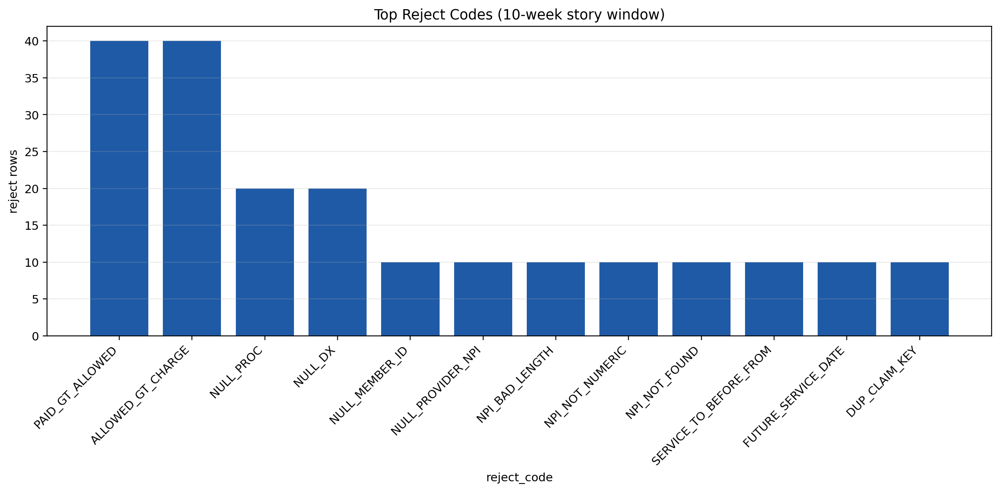
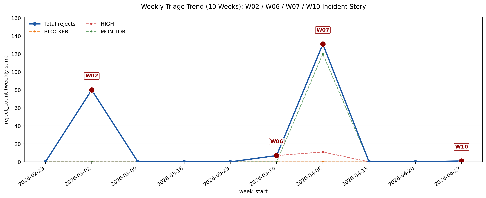

# Start Here (2 minutes)
1. [docs/Encounters_QA_Report.pdf](docs/Encounters_QA_Report.pdf) - story + findings
2. [docs/runbook_v0_1.md](docs/runbook_v0_1.md) - SOP (how ops runs it)
3. [docs/UAT_Evidence_Pack.pdf](docs/UAT_Evidence_Pack.pdf) - UAT + traceability proof
4. [docs/CASE_STUDY.md](docs/CASE_STUDY.md) - hiring manager narrative
5. [docs/AUDIT_RECEIPT.md](docs/AUDIT_RECEIPT.md) - audit trail receipt

# Encounters QA Lab (Encounters BA Evidence Pack)

## What this is
### Context & Scope Scenario (public-safe)
HarborPoint Health Plan receives weekly encounter batches from delegated vendors for multiple lines of business (e.g., Medicaid and Commercial). Before submitting these encounters to external reporting endpoints (state/federal programs), the Encounters team must catch blocking defects, prioritize remediation, and document a defensible audit trail.

This evidence pack simulates that workflow end-to-end:
- Row-level rejects (missing member/provider fields, invalid dates, eligibility outside coverage, duplicates, etc.)
- Batch-level flags when operational thresholds are exceeded (duplicate rate >1%, eligibility mismatch >2%, volume shift >15%)
- Ops decisions: Hold / Reprocess / Submit-with-monitoring
- UAT traceability for upgrades and vendor feed changes

Out of scope: This is not provider billing QA and not an EDI/837 parser; it's tabular pre-submit QA for payer encounter reporting.

Readable summary of a 10-week encounters QA story.

## Repo Map
Quick map of where key assets live:

- `docs/`: runbook, report exports, UAT evidence, KPI snapshot, and governance docs.
- `notebooks/`: validation, analysis, and UAT notebooks.
- `outputs/`: generated CSV outputs, screenshots, and UAT run artifacts.
- `data_raw/`: synthetic source inputs and reference tables.
- `src/`: dataset generator, verifiers, and snapshot/receipt builders.
- `scripts/`: release/export automation scripts.

Detailed map: [docs/REPO_MAP.md](docs/REPO_MAP.md)

## Outputs Index
- Source of truth: [SOURCE_OF_TRUTH_Encounters_QA_Lab.md](SOURCE_OF_TRUTH_Encounters_QA_Lab.md)
- Data inputs:
  - [data_raw/encounters_header.csv](data_raw/encounters_header.csv)
  - [data_raw/encounters_lines.csv](data_raw/encounters_lines.csv)
  - [data_raw/reference_members.csv](data_raw/reference_members.csv)
  - [data_raw/reference_providers.csv](data_raw/reference_providers.csv)
- Validation notebook: [notebooks/01_validate.ipynb](notebooks/01_validate.ipynb)
- Analysis notebook: [notebooks/02_analysis.ipynb](notebooks/02_analysis.ipynb)
- UAT notebook: [notebooks/03_uat.ipynb](notebooks/03_uat.ipynb)
- Core outputs:
  - [outputs/rejects.csv](outputs/rejects.csv)
  - [outputs/triage_summary.csv](outputs/triage_summary.csv)
  - [outputs/story_map.csv](outputs/story_map.csv)
  - [outputs/dataset_receipt.md](outputs/dataset_receipt.md)
- Screenshots:
  - [outputs/screenshots/top_rejects.png](outputs/screenshots/top_rejects.png)
  - [outputs/screenshots/triage_trend.png](outputs/screenshots/triage_trend.png)
- UAT evidence root: [outputs/uat/](outputs/uat/)
- Runbook SOP: [docs/runbook_v0_1.md](docs/runbook_v0_1.md)
- UAT plan: [docs/uat_test_plan.md](docs/uat_test_plan.md)
- Traceability matrix: [docs/traceability_matrix.csv](docs/traceability_matrix.csv)
- Defect triage template: [docs/defect_triage_template.md](docs/defect_triage_template.md)
- KPI snapshot (generated): [docs/kpi_snapshot.md](docs/kpi_snapshot.md)
- HTML reports:
  - [docs/Encounters_QA_Report.html](docs/Encounters_QA_Report.html)
  - [docs/UAT_Evidence_Pack.html](docs/UAT_Evidence_Pack.html)
- Export script: [scripts/export_reports.ps1](scripts/export_reports.ps1)

## KPI Snapshot (Generated)
Current KPIs are generated directly from outputs to prevent drift:
- [docs/kpi_snapshot.md](docs/kpi_snapshot.md)
- Rebuild with: `python src/build_kpi_snapshot.py`

## Decisions
| Signal | Operational Decision |
|---|---|
| BLOCKER > 0 | Do not submit. Resolve and revalidate first. |
| HIGH batch flags (`DUP_RATE_GT_1PCT`, `ELIG_MISMATCH_GT_2PCT`) | Remediate/reprocess impacted batch before submit/resubmit. |
| MONITOR (`VOLUME_SHIFT_GT_15PCT` + FINANCIAL/CODE_SET) | Submit with controls; trend weekly and capture RCA-lite notes. |

## Screenshots




## Quick Start (Contract-Locked Repro)
Run from repo root:

```powershell
.\.venv\Scripts\Activate.ps1
```

```powershell
python src/generate_dataset.py --seed 42 --run_date 2026-05-10 --out_dir .
python src/verify_dataset.py --run_date 2026-05-10
python src/verify_outputs.py
python src/build_kpi_snapshot.py
python src/verify_report_html.py
powershell -ExecutionPolicy Bypass -File scripts/export_reports.ps1 -SkipPdf
```

Expected result: verifiers pass and refreshed HTML reports are written to `docs/`.

## Release Checklist
1. Run release gate: `powershell -ExecutionPolicy Bypass -File` [scripts/release_gate.ps1](scripts/release_gate.ps1)
2. Manual PDF step (only if PDF export fails): print [docs/Encounters_QA_Report.html](docs/Encounters_QA_Report.html) and [docs/UAT_Evidence_Pack.html](docs/UAT_Evidence_Pack.html) to PDF.
3. Artifacts land in:
   - `docs/`: [Encounters_QA_Report.html](docs/Encounters_QA_Report.html), [UAT_Evidence_Pack.html](docs/UAT_Evidence_Pack.html), [kpi_snapshot.md](docs/kpi_snapshot.md), [AUDIT_RECEIPT.md](docs/AUDIT_RECEIPT.md)
   - `outputs/`: rejects, triage, story map, submission tracker template, and UAT folder evidence

## Optional: Re-Execute Notebooks
If you want to regenerate validation/UAT artifacts by executing notebooks:
```powershell
python -m nbconvert --to notebook --execute --inplace notebooks/01_validate.ipynb
python -m nbconvert --to notebook --execute --inplace notebooks/03_uat.ipynb
```

## Export HTML/PDF (Code Hidden)
Run:
```powershell
powershell -ExecutionPolicy Bypass -File scripts\export_reports.ps1
```

This produces code-hidden HTML:
- `docs/Encounters_QA_Report.html`
- `docs/UAT_Evidence_Pack.html`

Script also attempts PDF export with `--to pdf --no-input`.

## PDF Fallback
If PDF export fails due to missing pandoc/LaTeX:
1. Open `docs/Encounters_QA_Report.html` in browser.
2. Press `Ctrl+P`.
3. Choose `Save as PDF`.
4. Save to `docs/Encounters_QA_Report.pdf`.
5. Repeat for `docs/UAT_Evidence_Pack.html` -> `docs/UAT_Evidence_Pack.pdf`.
