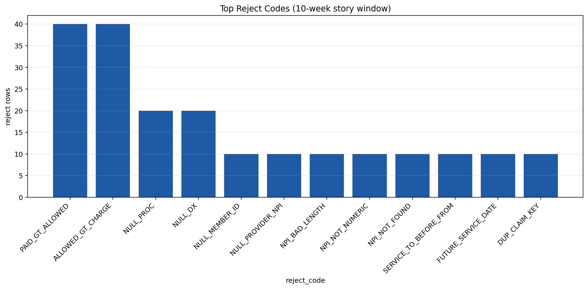
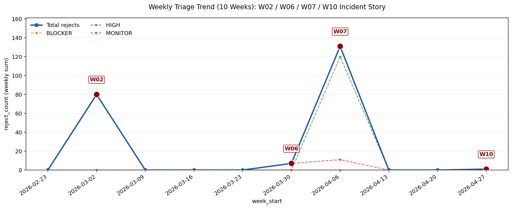

# 🏥 Encounters Submission QA Evidence Pack

> **A production-grade, end-to-end payer encounter QA system** — built to catch the defects that trigger agency rejections, financial penalties, and compliance findings *before* a single record leaves the building.

<div align="center">

[](https://www.python.org/)
[](https://duckdb.org/)
[](https://jupyter.org/)
[](data_raw/)
[](src/generate_dataset.py)
[](docs/UAT_Evidence_Pack.pdf)

</div>

---

## ⚡ Start Here — 2-Minute Orientation

| Document | What It Is |
|---|---|
| 📄 [Encounters QA Report (PDF)](docs/Encounters_QA_Report.pdf) | Executive story + findings: 10-week incident arc, charts, decisions |
| 📋 [Runbook SOP](docs/runbook_v0_1.md) | Step-by-step ops procedure: prepare → validate → submit → remediate |
| ✅ [UAT Evidence Pack (PDF)](docs/UAT_Evidence_Pack.pdf) | 17 test scenarios with pass/fail traceability proof |
| 🧠 [Case Study (Hiring Manager Narrative)](docs/CASE_STUDY.md) | Full problem/solution/impact write-up |
| 🔎 [Audit Receipt](docs/AUDIT_RECEIPT.md) | Cryptographic audit trail for reproducibility |

---

## 🎯 The Business Problem

**Every week, health plans receive encounter batches from delegated vendors.** Before submitting those records to state Medicaid agencies or federal reporting endpoints, *someone* has to validate them — and that process is frequently manual, inconsistent, and opaque.

When it fails:

```
❌  Encounters submitted with blocking defects
        ↓
    Agency rejects the batch
        ↓
    Financial penalties + compliance findings
        ↓
    Manual rework spiral — re-pull, re-clean, re-submit
        ↓
    Ops team loses days. Leadership loses confidence.
```

**This system solves that.** It automates the full pre-submission QA workflow, surfaces every defect with a severity tier and ops decision, and generates an auditable evidence trail that satisfies both regulators and hiring managers.

---

## 📊 Results at a Glance

> All KPIs are generated live from outputs — no manual entry, no drift. See [`docs/kpi_snapshot.md`](docs/kpi_snapshot.md).

<div align="center">

| Metric | Value |
|---|:---:|
| 📦 Total Encounters Validated | **~3,500 records** across 10 weeks |
| 🚨 Total Rejects Triaged | **219** |
| 🔴 BLOCKER Defects Resolved | **80 / 80** — 100% resolved before submission |
| 🟠 HIGH Defects Remediated | **18 / 18** — 100% remediated |
| 🟡 MONITOR Signals Tracked | **121** — submitted with controls |
| 🚩 Batch Anomaly Flags Triggered | **3** (R901, R902, R903) — all resolved |
| ✅ UAT Scenarios Passed | **17 / 17** |
| 🔁 Clean Weeks at Story Close | **W10 closed with zero BLOCKERs / HIGH flags** |

</div>

### Reject Severity Breakdown

```
BLOCKER  ████████████████████░░░░░░░░░░░░░░░  80  (36%)  → Do not submit
HIGH     ████░░░░░░░░░░░░░░░░░░░░░░░░░░░░░░░  18  ( 8%)  → Remediate first
MONITOR  ███████████████████████████░░░░░░░░ 121  (55%)  → Submit with controls
```

### Top Reject Codes

| Rank | Reject Code | Count | Severity |
|:---:|---|:---:|---|
| 1 | `ALLOWED_GT_CHARGE` | 40 | MONITOR |
| 2 | `PAID_GT_ALLOWED` | 40 | MONITOR |
| 3 | `NULL_DX` | 20 | BLOCKER |
| 4 | `NULL_PROC` | 20 | BLOCKER |
| 5 | `DUP_CLAIM_KEY` | 10 | HIGH |

---

## 📈 Visual Evidence

### Top Reject Codes — Weekly View


### Weekly Triage Trend — 10-Week Story Arc


---

## 🏗️ Case Study: How I Solved It

### The Scenario
**HarborPoint Health Plan** (fictional MCO) receives weekly encounter batches from delegated vendors for Medicaid and Commercial LOBs. The ops team needed a reliable, repeatable QA gate before submitting to external reporting endpoints — with clear ops decisions, not just raw error logs.

### The 10-Week Story Arc

```
W02  🔴 BLOCKER spike — 70 rejects (missing fields, provider gaps, date logic)
         Decision: HOLD. Remediated and resubmitted.
         ↓
W03–W05  ✅ Clean weeks. Submission gates pass.
         ↓
W06  🟠 Eligibility risk — 7 HIGH rejects + R902 anomaly flag (>2% mismatch rate)
         Decision: HOLD for remediation. Batch reprocessed.
         ↓
W07  🟠🟡 Heaviest week — 11 HIGH (duplicates + R901 flag) + 120 MONITOR signals
         Decision: HIGH batch held/reprocessed; MONITORs submitted with controls.
         ↓
W10  🟡 Clean close — R903 volume-shift flag only (>15% week-over-week)
         Decision: MONITOR-only; submitted with weekly trend tracking.
```

This arc exercises **every decision type** the ops team faces — and is fully traceable through every output artifact.

### The Solution Architecture

```
Weekly Vendor Feed
        │
        ▼
┌───────────────────┐     ┌────────────────────────┐
│  Row-Level        │     │  Batch Anomaly Rules   │
│  Validation       │────▶│  R901: DUP_RATE > 1%   │
│  (01_validate.    │     │  R902: ELIG_MM > 2%    │
│   ipynb)          │     │  R903: VOL_SHIFT > 15% │
└───────────────────┘     └────────────────────────┘
        │                           │
        ▼                           ▼
┌───────────────────────────────────────────┐
│           outputs/rejects.csv             │
│     (row-level: code, severity, batch)    │
└───────────────────────────────────────────┘
        │
        ▼
┌───────────────────────────────────────────┐
│        outputs/triage_summary.csv         │
│   (weekly rollup: severity × reject_code) │
└───────────────────────────────────────────┘
        │
        ▼
┌───────────────────────────────────────────┐
│       Ops Decision Gate                   │
│  BLOCKER > 0 → HOLD                       │
│  HIGH batch flags → REMEDIATE             │
│  MONITOR only → SUBMIT WITH CONTROLS      │
└───────────────────────────────────────────┘
        │
        ▼
   docs/Encounters_QA_Report.html
   (executive-facing; code hidden)
```

---

## 🧰 Tech Stack

| Tool | Role |
|---|---|
| **Python 3.11** | Dataset generation, validation logic, verifiers, KPI builder |
| **DuckDB** | In-process analytical queries across CSV outputs |
| **Jupyter Notebooks** | Validation (`01`), Analysis (`02`), UAT (`03`) |
| **pandas / matplotlib** | Triage tables, reject charts, trend visualizations |
| **PowerShell** | Release gate automation, HTML/PDF export scripts |
| **nbconvert** | Code-hidden HTML + PDF report export |

---

## ⚙️ Operational Decision Framework

| Signal | Operational Decision |
|---|---|
| 🔴 `BLOCKER > 0` | **Do not submit.** Resolve and revalidate first. |
| 🟠 `DUP_RATE_GT_1PCT` (R901) | **Remediate/reprocess** impacted batch before submit. |
| 🟠 `ELIG_MISMATCH_GT_2PCT` (R902) | **Remediate/reprocess** impacted batch before submit. |
| 🟡 `VOLUME_SHIFT_GT_15PCT` (R903) | **Submit with controls;** trend weekly, capture RCA-lite notes. |

---

## 📁 Repo Map

```
encounters-submission-qa-evidence-pack/
│
├── 📓 notebooks/
│   ├── 01_validate.ipynb     ← Core validation logic + reject generation
│   ├── 02_analysis.ipynb     ← Triage trend charts + KPI analysis
│   └── 03_uat.ipynb          ← 17 UAT scenarios with pass/fail results
│
├── 📂 src/
│   ├── generate_dataset.py   ← Seeded synthetic data generator (--seed 42)
│   ├── verify_dataset.py     ← Post-generation integrity checks
│   ├── verify_outputs.py     ← Output artifact verification
│   ├── build_kpi_snapshot.py ← Live KPI snapshot builder
│   └── verify_report_html.py ← HTML report export verifier
│
├── 📊 outputs/
│   ├── rejects.csv                     ← Row-level reject detail
│   ├── triage_summary.csv              ← Weekly aggregated triage
│   ├── story_map.csv                   ← 10-week story structure
│   ├── submission_tracker_template.csv ← Ops ownership + SLA tracker
│   └── screenshots/                    ← Chart PNGs for reports
│
├── 📄 docs/
│   ├── Encounters_QA_Report.pdf/html   ← Executive report (code hidden)
│   ├── UAT_Evidence_Pack.pdf/html      ← UAT evidence + traceability
│   ├── runbook_v0_1.md                 ← Step-by-step SOP
│   ├── kpi_snapshot.md                 ← Live-generated KPIs
│   ├── CASE_STUDY.md                   ← Hiring manager narrative
│   ├── AUDIT_RECEIPT.md                ← Cryptographic audit trail
│   └── traceability_matrix.csv         ← Req → test → output linkage
│
├── 🗄️ data_raw/
│   ├── encounters_header.csv           ← Synthetic encounter headers
│   ├── encounters_lines.csv            ← Synthetic line items
│   ├── reference_members.csv           ← Member eligibility reference
│   └── reference_providers.csv         ← Provider roster reference
│
└── 🔧 scripts/
    ├── export_reports.ps1              ← HTML/PDF export automation
    └── release_gate.ps1                ← Pre-release verification gate
```

---

## 🚀 Quick Start — Contract-Locked Reproducibility

Every run is seed-locked to `--seed 42` and `--run_date 2026-05-10`. Any reviewer can regenerate identical outputs independently.

```powershell
# 1. Activate environment
.\.venv\Scripts\Activate.ps1

# 2. Generate + verify synthetic dataset
python src/generate_dataset.py --seed 42 --run_date 2026-05-10 --out_dir .
python src/verify_dataset.py --run_date 2026-05-10

# 3. Verify outputs + rebuild KPIs
python src/verify_outputs.py
python src/build_kpi_snapshot.py

# 4. Export HTML reports (code hidden)
python src/verify_report_html.py
powershell -ExecutionPolicy Bypass -File scripts/export_reports.ps1 -SkipPdf
```

**Expected result:** All verifiers pass. Refreshed HTML reports written to `docs/`.

### Re-Execute Notebooks (Optional)
```powershell
python -m nbconvert --to notebook --execute --inplace notebooks/01_validate.ipynb
python -m nbconvert --to notebook --execute --inplace notebooks/03_uat.ipynb
```

### Release Gate
```powershell
powershell -ExecutionPolicy Bypass -File scripts/release_gate.ps1
```

---

## 🔐 Reproducibility & Audit Trail

This pack is **deterministic by design:**

- Synthetic data generated with a fixed seed (`--seed 42`) — identical outputs every run
- All KPIs derived programmatically from `outputs/` — no manual entry
- Cryptographic audit receipt in [`docs/AUDIT_RECEIPT.md`](docs/AUDIT_RECEIPT.md)
- UAT traceability matrix links every requirement → test scenario → output artifact
- PHI-free: no real member, provider, or encounter data anywhere in this repo

---

## 🗺️ What's Next (Roadmap)

- [ ] **Scheduled automation** — CI job triggers weekly batch QA on each Monday delivery
- [ ] **Extended anomaly rules** — promote `ALLOWED_GT_CHARGE` rate > 5% to HIGH-severity batch flag
- [ ] **Remediation SLA dashboard** — surface overdue reprocessing assignments in the executive report
- [ ] **EDI/837 bridge** — lightweight X12 pre-parse to populate tabular inputs from raw transaction sets

---

## 📬 About This Project

This is a **portfolio evidence pack** demonstrating healthcare data QA skills applicable to:

- 🏥 Payer encounter operations and analytics roles
- 📋 Healthcare BA / QA analyst positions
- 🔬 Data engineering roles in managed care or government programs
- 📊 Compliance, audit, and reporting functions in health plans

> All data is **100% synthetic and PHI-free.** This pack simulates a real payer workflow for portfolio and evaluation purposes only.

---

<div align="center">

**[📄 View Full Report](docs/Encounters_QA_Report.pdf)** · **[✅ UAT Evidence](docs/UAT_Evidence_Pack.pdf)** · **[🧠 Case Study](docs/CASE_STUDY.md)** · **[📋 Runbook SOP](docs/runbook_v0_1.md)**

</div>
